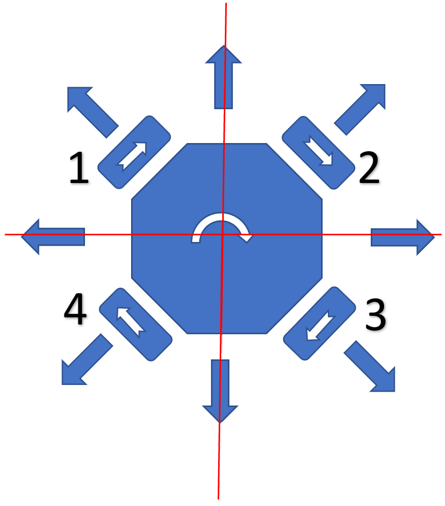
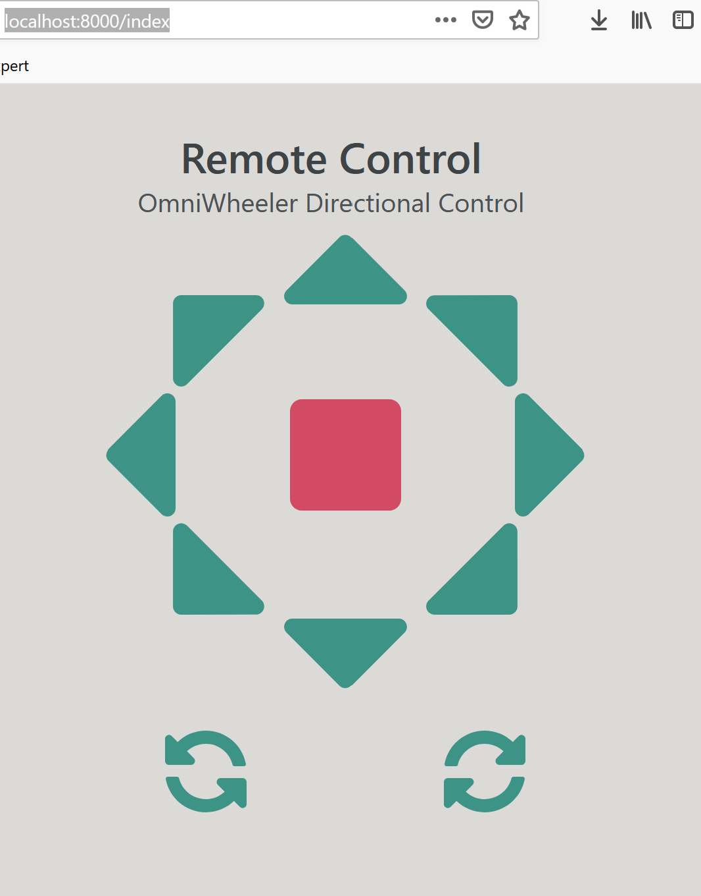

# OmniWheeler 2020
***Project Description***

This robot is intended to serve as a universal platform for creating and testing self-navigation software.

***Hardware Decisions***

The advantage of four Omni Wheels is the absolute freedom of movement on a plane without any wheel steering. 
In other words, the wheels’ axel is fixed. 

*Omni wheels* can generate active traction when rotating around their natural axis and be passive (present no resistance) when dragged in the perpendicular direction.

This geometry allows any platform supported by four omni wheels in a diamond configuration (see image) to move in any direction maintaining the same heading, or spin on their Z axis and rotate its heading at will.

In particular, they offer the challenge of programming the differential rotation of its wheels to follow ANY path at ANY speed at ANY heading. This is particularly advantageous if you need to keep your aim in any particular direction while following the path indicated by the autonomous navigation system.

One example would be the mount of a video recording device (camera, lidar) that tracks a moving object while following any arbitrary path at any speed (within the limits of a max lateral acceleration). 
___

This particular 2020 version uses four 4” OD omni wheels driven by four brushed 12V DC motors with quadrature encoders.

The guidance is provided by a ***Raspberry Pi 3B+ or 4*** (1GB RAM) with a 120 deg wide angle camera and four ultrasonic sensors. 

As an alternative for future application, a ***Jetson Nano*** could replace the Pi. Both the Pi and the Nano run a similar Linux distro (Raspberry Pi OS, and Ubuntu 18.04) and offer the same 40 GPIO configuration, so the Python code should be interchangeable.
The quadrature encoder sends feedback information regarding their rotation to a controller board.

**NOTE:** These encoders are not of the absolute type. They can only sense the rotation of each wheel and from it derive speed, acceleration, direction and traveled distance on the basis of odometry, but not the absolute position of the wheels.
Motor control signal is achieved through PID (Proportional, Integral, Derivative) algorithm. Before copying code (there are plenty of examples on GitHub), it is necessary to become familiar with the PID concept and math, although the DAGU 4 channel board does most of the heavy lifting. 

### Wheel Movement
    from observation there are only three whell spining states which dictate the direction that
    the robot moves.
        ACW = Anti-clockwise
        CW = Clockwise
        Still = No movement.

### Four Wheels
    These are controlled by GPIO indicating motor state (on/off) and rotation
    ACW/CW.

    Wheel 1:
        Motor: ON/OFF 
            GPIO 7
        Rotation: ACW/CW
            GPIO 11

    Wheel 2:
        Motor: ON/OFF 
            GPIO 13
        Rotation: ACW/CW
            GPIO 15

    Wheel 3:
        Motor: ON/OFF 
            GPIO 19
        Rotation: ACW/CW
            GPIO 21
        
    Wheel 4:
        Motor: ON/OFF 
            GPIO 23
        Rotation: ACW/CW
            GPIO 29

### Direction of Movement (Robot)

    There are at the moment 11 possible directions of movement for the robot.
    
    Original:   North   East    North-East  North-West  Clockwise       Full-Stop
    Inverted:   South   West    South-West  South-East  Anti-Clockwise    N/A

***Software Decisions***

**Operating System:** Althought Ubuntu 18.04 LTS is the target OS.
For the initial testing I used Ubuntu Mate 64bit for RPI.  This can be downloaded at: 

https://ubuntu-mate.org/download/arm64/focal/

***
Raspbian 32bit instructions are provided at the end of this file, MiniForge is 64bit and MiniConda is not compiled for ARM processors.  Therefore venv and pip are the better options if you plan to use Raspbian.
***

**Programing Language:** Python3 and JavaScript for the web application.

**Miniforge** is used to manage the Python environments and to install the libraries required to program the *omniwheeler*. Miniforge is similar to Anaconda's Distribution of Python's tool Miniconda, with the notable difference that Miniforge is compiled to also run on ARM64 devices such as the Raspberry Pi.  Using environments would allow for a more granular control of the Python 3 software used on the project as well as facilitate for others to recreate this environment. 

**Web Based Remote Control**

The application runs on **FastAPI** and interfaces with the web based remote control user interface using WebSockets.

*Possible functionality could be enhanced by providing an option within the web based remote control app to switch between autonomous navigation which could possible include a live video feed of what the robot is seing, and the standard remote control manual guidance*

___
***Possible Changes, TODO List**
___
Regarding the GPIO controls
    I have started thinking about using gpiozero for the control

and I have also started thinking about using docker to run the robot

ZeroMQ and Redis as alternatives to ROS 2, ROS 1 is out of the question.

instructions on how to install python3 and the environment required
to run this application.

miniforge location of ARM64 RaspberryPi python3
https://github.com/conda-forge/miniforge/releases/latest/download/Miniforge3-Linux-aarch64.sh

___
# ***Installation Instructions.***

***These instructions are for the software to be installed on the OmniWheeler's Raspberry Pi or similar device.***

**Download or Clone the OmniWheeler's repository from:**

https://github.com/tzunun/Omniwheeler

**Download Miniforge**

From the command line you can use **wget** to install miniforge as follows:

`wget -c https://github.com/conda-forge/miniforge/releases/latest/download/Miniforge3-Linux-aarch64.sh -P ~/Downloads`

The command downloaded Miniforge to the Downloads folder:

You may also click on the following link and the browser will download it, usually to the downloads folder.

https://github.com/conda-forge/miniforge/releases/latest/download/Miniforge3-Linux-aarch64.sh

**Install Miniforge**

From the terminal run the following command (***Do not make this file executable or change its permissions!)***:

`bash ~/Downloads/Miniforge3-Linux-aarch64.sh`

Accept the default settings for the installation of Miniforge.

___
# ***`Instructions under this line are incomplete as they have not been tested yet!!!`***
___

**Activate Miniforge**

The easiest way to activate the base environment is to close and open the terminal.  You may also run 
the following command from the command line:

`source ~/.bashrc`

The command prompt should start with '(base)' for example:

`(base) username@usercomputer:$`

**Create the Python 3 environment, using the *omniwheeler.txt* file.**

`conda create --name omniwheeler --file omniwheeler.txt`

**To Launch the Web App:**

Activate the omniwheeler environment:

`conda activate omniwheeler`

Once active the omniwheeler environment the prompt should start with:

`(omniwheeler) username@usercomputer:~$`

Install RPI.GPIO using pip:

`pip install RPI.GPIO`
    
    Make sure that the omniwheeler environment is active and that you are inside the Omniwheeler directory.

Run the following command:

`uvicorn src.html:app --reload`

The Remote Control Web App is now running.  To access it open a browser and navigate to:

http://localhost:8000/index

You should see something similar to this picture.  The icons denote the omniwheeler's direction of movement.

___
# ***`Note!`***

The remote control functionality 
has not been fully implemented.  The Web App does communicate with the backend (Python 3 code that controls the Omniwheeler.)

If using venv for a Python3 env you will have to install websockets using pip.

conda did not have this issue. (not quite sure about this.  I will test this in the future)

The reason I would used conda is because of certain AI tasks that will be implementd in the future.

# Raspbian Instructions.

Clone the repository.

`git clone https://github.com/tzunun/Omniwheeler.git`

Create a virtual environment.

`python3 -m venv omniwheeler`

Activate the environment

`source omniwheeler/bin/activate`

Your prompt should look similar to this.

`(omniwheeler) pi@raspberrypi:~ $`

There are now two omniwheeler folders on your RPI, ***omniwheeler*** is for the virtual environment.  ***Omniwheeler*** is the repository with the code.

Use pip to install the required libraries.

`pip install fastapi jinja2 uvicorn websockets RPi.GPIO`

Navigate to the directory Omniwheeler

`cd Omniwheeler`

Run the app.  (The reload is to watch for code changes and implement them right away.  You may obmit --reload)

`uvicorn src.html:app --host 0.0.0.0 --reload`

In browser navigate to either :

    localhost:8000/index
    raspberry_pi_IP_address:8000

If you don't know the RPI ip address, if it is connected already you can use `ping -c 1 raspberrypi.local` to try to obtain the ip address

